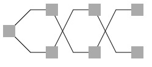
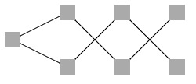

# dagrejs - Layered layout for directed acyclic graph

**This project is a fork from [dagre](https://github.com/dagrejs/dagre). For more information prelase refer to origin project.**

## Enhanced features

New features:
* support specify layer(rank) for certain node
* support manually control nodes' order
* support keep origin layout when re-layout with nodes added

Optimizations:
* rewrite rank algorithm to support assign layer
* consider previous iteration result at node-ordering step
* support generate `edgeLabelSpacing` or not, which controls generate dummy node between nodes

## Usage

> For full usage please refer to dagre's documentation: https://github.com/dagrejs/dagre/wiki.

### edgeLabelSpace

Default dagre always generate dummy node for every edge, which can be used for edge's curve drawing, etc. If you do not need it, disable it in layout's options:

```js
dagre.layout(g, {
  edgeLabelSpace: false
})
```

Bellow shows graph with or without `edgeLabelSpace`:




### Specify layer

Now you can manually specify node's layer(rank) by add layer in node's attribute:

```js
const data = {
    nodes: [
        { id: '0' },
        { id: '1', layer: 1 },
        { id: '2', layer: 3 },
        { id: '3' },
    ],
    // edges: [...]
}

data.nodes.forEach((n) => {
    g.setNode(n.id, n);
});
```

Caution:
* layer is **0-indexed**, which means the root node's layer is 0
* manual layer **should not** violate DAG's properties (e.g. You cannot assign a layer value for a target node greater or equal to cresponding source node.)

### Control nodes' order

Sometimes we want to manually control nodes' order in every layer in case of unexpected result caused by alogrithm. Now we can also configurate in options.

```js
dagre.layout(g, {
  keepNodeOrder: true,
  nodeOrder: ['3', '2', '1', '0'] // an array of nodes's ID.
});
```

A common usage is keeping data's order:
```js
const data = {
    nodes: [
        { id: '0' },
        { id: '2' },
        { id: '3' },
        { id: '1' },
    ],
    // edges: [...]
}

dagre.layout(g, {
  keepNodeOrder: true,
  nodeOrder: data.nodes.map(n => n.id)
});
```

Caution:
* The order only work at same layer ordering step. It does not affect the layer assignment step.
* Like specifying layer, internally the library added `fixorder` attribute for each node. Of cause you can manually set this attribute, but it introduces ambiguity.

### Keep origin layout

When re-layout with small modification, we may want to keep origin layout result. Now we can pass the origin graph to new layout function:

```js
dagre.layout(originGraph) // layout() will internally modify originGraph
dagre.layout(
  g,
  {
    prevGraph: originGraph // pass originGraph to new function
  }
);
```

For full example please refer to `add-subgraph` example in examples folder.